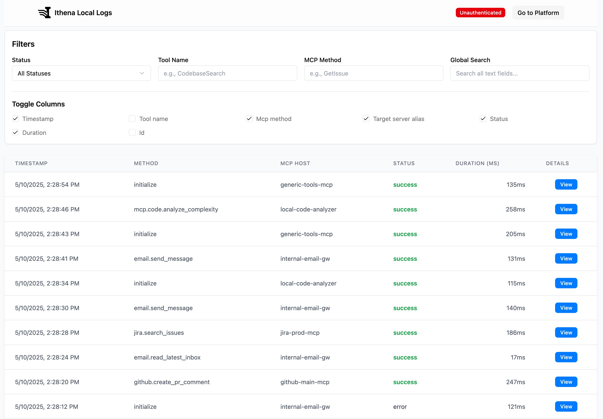

<p align="center">
  
</p>

# Ithena CLI for MCP Observability
[](https://opensource.org/licenses/MIT)
[](https://x.com/andellvan)


The Ithena CLI (`ithena-cli`) makes debugging your **Model Context Protocol (MCP)** interactions effortless. It acts as a lightweight wrapper around your MCP server commands, instantly showing you the JSON-RPC messages flowing between your AI agent (client) and server.

**Unlock the full potential of MCP observability with the [Ithena.one platform](https://ithena.one) for persistent storage, team collaboration, and advanced analytics.**

**See your MCP traffic locally, in real-time, without sending data to the cloud.**

<p align="center">
  
</p>

## Key Benefits for MCP Developers

*   **Instant Local Visibility:** Immediately see requests, responses, errors, and timings for MCP calls. No more "silent failures" or guessing what parameters were sent.
*   **Local-First Debugging:** Captured MCP interactions are stored locally by default. Use `ithena-cli logs show` to launch a local web UI and query your logs – **no account or internet connection required for core debugging.**
*   **Flexible Configuration:** Choose between a detailed `wrappers.yaml` for complex setups or direct command wrapping within your MCP client's JSON for simplicity.
*   **Effortless Setup:** Simply configure your MCP client to launch `ithena-cli`, which then runs your target MCP server. No code changes to your client or server needed.
*   **Works with Existing MCP Servers:** Easily wrap official servers (like the GitHub MCP Server) or your custom implementations.
*   **JSON-RPC Aware:** Understands and pretty-prints MCP's JSON-RPC messages for easy reading.
*   **Securely Handles Secrets:** Uses placeholders to inject sensitive data (like API keys for your MCP server) from your system keyring or environment variables, keeping them out of your config files when using `wrappers.yaml`.
*   **Enhanced Cloud Capabilities (Optional):** Unlock persistent storage, team collaboration, and advanced analytics by connecting to the [Ithena.one platform](https://ithena.one).

## Installation

**Recommended Method (Linux/macOS):**

Open your terminal and run the following command to download and install the latest version of `ithena-cli` automatically:

```bash
curl -sfL https://raw.githubusercontent.com/ithena-one/ithena-cli/main/install.sh | bash
```

This script will:
1.  Detect your operating system (Linux or macOS) and architecture (amd64 or arm64).
2.  Download the correct binary from the latest GitHub release.
3.  Make it executable.
4.  Attempt to move it to `/usr/local/bin/ithena-cli`. If this directory is not writable, it will prompt for `sudo` access.

**Manual Installation:**

If you prefer, you can still install `ithena-cli` manually:

1.  **Download the Latest Release:**
    Go to the [Ithena CLI GitHub Releases page](https://github.com/ithena-one/ithena-cli/releases) and download the appropriate `ithena-cli_OS_ARCH.tar.gz` archive for your operating system and architecture (e.g., `ithena-cli_darwin_amd64.tar.gz`, `ithena-cli_linux_arm64.tar.gz`).

2.  **Extract, Make Executable, and Place in your PATH:**
    Open your terminal. After downloading:
    ```bash
    # Example (replace with your actual downloaded filename and desired path)
    tar -xzf ithena-cli_your-os_your-arch.tar.gz
    chmod +x ./ithena-cli
    sudo mv ./ithena-cli /usr/local/bin/ithena-cli
    ```

*   **For Windows:**
    1.  Download the `ithena-cli_windows_amd64.zip` (or equivalent) file from the [Releases page](https://github.com/ithena-one/ithena-cli/releases).
    2.  Extract `ithena-cli.exe`.
    3.  Move `ithena-cli.exe` to a folder that is included in your system's PATH environment variable (e.g., you could create `C:\Program Files\ithena-cli\` and add that to PATH).

**3. Verify Installation:**
```bash
ithena-cli --version
```

**4. Connect to the Ithena Platform (Recommended for Full Experience):**

While `ithena-cli` works perfectly for local debugging, connecting it to the [Ithena.one platform](https://ithena.one) unlocks persistent storage for your MCP logs, team collaboration features, and advanced analytics.

To connect, run:
```bash
ithena-cli auth
```
Follow the on-screen instructions. This will securely link the CLI to your Ithena account.

## Quick Start: Adding MCP Observability

`ithena-cli` wraps your existing MCP server commands to capture traffic. You have two main ways to configure this:

<details>
<summary><strong>Option 1: Using a <code>wrappers.yaml</code> Configuration File (Recommended for multiple or complex setups)</strong></summary>

This method uses a separate YAML file (`.ithena-wrappers.yaml` by default) to define named profiles for your MCP servers. This is ideal if you have multiple servers or complex configurations with specific environment variables or arguments, especially if you want to use secret placeholders like `{{keyring:...}}`.

**Step A: Create your `wrappers.yaml` file:**

For example, to wrap the official [GitHub MCP Server](https://github.com/github/github-mcp-server):
Create `~/.config/ithena/wrappers.yaml` (global) or `.ithena-wrappers.yaml` (project-local):

```yaml
# ~/.config/ithena/wrappers.yaml
wrappers:
  mcp-github-docker: # A nickname for this wrapper configuration
    # This is the actual command that runs the GitHub MCP server
    command: docker
    args:
      - run
      - -i          # interactive
      - --rm        # remove container on exit
      - -e          # pass environment variable to docker
      - GITHUB_PERSONAL_ACCESS_TOKEN # Name of the env var for Docker
      - ghcr.io/github/github-mcp-server # The Docker image
    env:
      # This tells ithena-cli to get GITHUB_PERSONAL_ACCESS_TOKEN
      # from the environment ithena-cli itself is run with
      # (which will be set in your MCP client's config, see Step B).
      GITHUB_PERSONAL_ACCESS_TOKEN: "{{env:GITHUB_PERSONAL_ACCESS_TOKEN}}"
    alias: "GitHub MCP (Docker)"
```

**Step B: Configure Your MCP Client (e.g., `mcp.json`) to use the `ithena-cli` wrapper profile:**

Update your MCP client's configuration file (e.g., `~/.cursor/mcp.json`):
```json
{
  "mcpServers": {
    "github": { // The name your MCP client uses for this server
      "command": "ithena-cli",
      "args": [
        "--wrapper-profile",
        "mcp-github-docker", // Must match the name in your wrappers.yaml
        "--wrapper-config-file", // Optional: if not using default location
        "~/.config/ithena/wrappers.yaml"
      ],
      "env": {
        // This GITHUB_TOKEN is passed to ithena-cli,
        // which then makes it available for the {{env:...}} placeholder in wrappers.yaml.
        "GITHUB_PERSONAL_ACCESS_TOKEN": "ghp_your_actual_github_pat_here..."
      }
    }
  }
}
```
Now, when your client starts the "github" server, it runs `ithena-cli` which then executes the Docker command from your `wrappers.yaml` profile.

</details>

<br>

<details>
<summary><strong>Option 2: Direct Command Wrapping in `mcp.json` (Simpler for one-off setups)</strong></summary>

For a simpler setup, or if you only need to wrap a single command without a separate YAML file, you can pass the server command directly to `ithena-cli` via arguments in your MCP client's `mcp.json`. Note that secret placeholders like `{{keyring:...}}` are only available when using a `wrappers.yaml` file.

**Configure Your MCP Client (e.g., `mcp.json`):**

Update your MCP client's configuration file (e.g., `~/.cursor/mcp.json`):
```json
{
  "mcpServers": {
    "github-direct": { // The name your MCP client uses for this server
      "command": "ithena-cli", // ithena-cli is the command
      "args": [
        // --- ithena-cli specific flags first ---
        "--alias", // Optional: give this wrapped command an alias for logs
        "GitHub-MCP-Direct",
        // --- Separator: indicates the start of the command to wrap ---
        "--",
        // --- The actual command and its arguments for your MCP server ---
        "docker",   // The actual command to run
        "run",      // Arg 1 for docker
        "-i",       // Arg 2 for docker
        "--rm",     // Arg 3 for docker
        "-e",       // Arg 4 for docker
        "GITHUB_PERSONAL_ACCESS_TOKEN", // Arg 5 for docker
        "ghcr.io/github/github-mcp-server" // Arg 6 for docker
      ],
      "env": {
        // Environment variables for the wrapped command (docker run...)
        // These are passed directly to the 'docker run' command.
        "GITHUB_PERSONAL_ACCESS_TOKEN": "ghp_your_actual_github_pat_here..."
      }
    }
  }
}
```

**Explanation:**
*   `"command": "ithena-cli"`: Your MCP client launches `ithena-cli`.
*   `"args"`:
    *   Any flags for `ithena-cli` itself (like `--alias`) come *before* the `--` separator.
    *   The `--` (double dash) tells `ithena-cli` that everything following it is the actual command and arguments to execute and wrap.
    *   `"docker", "run", ...`: This is the command and arguments for the GitHub MCP server.
*   `"env"`: These environment variables are made available by `ithena-cli` to the command being wrapped (in this case, the `docker run` command).

This "direct wrapping" method avoids needing a separate `wrappers.yaml` if you just want to quickly wrap a command.

</details>

**After setting up with either option:**

**Run Your Agent & View Logs:**

Start your MCP client. When it tries to use the configured server, `ithena-cli` will now capture the MCP communication.

To see the captured MCP interactions:
```bash
ithena-cli logs show
```
This starts a local web server (default: port 8675). Open the provided URL in your browser to view, search, and filter your MCP logs.

## Optional: Connecting to the Ithena Platform

If you want persistent storage, team collaboration features, or advanced analytics for your MCP logs, you can connect `ithena-cli` to your Ithena account.

**1. Authenticate:**
```bash
ithena-cli auth
```
Follow the on-screen instructions (device authorization flow). This securely stores an access token in your system keychain.

Once authenticated, `ithena-cli` will automatically attempt to send captured MCP logs to the Ithena platform. If it can't (e.g., offline), logs are still stored locally.

**Check Status:**
```bash
ithena-cli auth status
```

**Logout:**
```bash
ithena-cli auth logout
```

## `wrappers.yaml` Configuration Details (Option 1)

The `wrappers.yaml` file defines named profiles for commands `ithena-cli` can wrap. This method is powerful for managing multiple server configurations and using advanced features like secret placeholders.

**Example `.ithena-wrappers.yaml`:**
```yaml
# Default location: ./.ithena-wrappers.yaml or ~/.config/ithena/wrappers.yaml
wrappers:
  mcp-github-docker: # Profile name used with --wrapper-profile
    command: docker
    args:
      - run
      - -i
      - --rm
      - -e
      - GITHUB_PERSONAL_ACCESS_TOKEN
      - ghcr.io/github/github-mcp-server
    env: # Environment variables for the 'docker run' command
      GITHUB_PERSONAL_ACCESS_TOKEN: "{{env:GITHUB_TOKEN_FROM_MCP_CLIENT}}" # See note below
    alias: "GitHub MCP (Docker)"

  my-custom-python-mcp:
    command: python3
    args:
      - /path/to/my_project/custom_mcp_server.py
      - --port
      - "8081"
    env: # Environment variables for the 'python3' command
      MY_SERVER_API_KEY: "{{keyring:custom-server-keys:api_key}}"
      LOG_LEVEL: "INFO"
      CONFIG_PATH: "{{file:/etc/custom/server_config.json}}"
    alias: "Custom Python Server"
```

**Placeholders for `env` in `wrappers.yaml`:**

These placeholders are resolved by `ithena-cli` *before* executing the wrapped command:

*   `{{env:VAR_NAME}}`: Resolves to the value of `VAR_NAME` from the environment `ithena-cli` itself is running in. This is typically how you pass secrets from your MCP client's `env` block (like `GITHUB_TOKEN_FROM_MCP_CLIENT` in the example) into the `wrappers.yaml` configuration.
*   `{{keyring:service:account}}`: Resolves to a secret stored in your system's keyring. Useful for API keys or other sensitive data your *MCP server* needs, keeping them out of plain text configuration.
*   `{{file:/path/to/file}}`: Resolves to the content of the specified file.

## `ithena-cli` Commands & Flags

**Core Wrapper Invocation:**

*   **Using `wrappers.yaml` profile:**
    ```bash
    ithena-cli --wrapper-profile <profile_name> [--wrapper-config-file <path>]
    ```
*   **Direct Command Wrapping (no YAML profile needed):**
    ```bash
    ithena-cli [--alias <log_alias>] -- <command_to_run> [args_for_command...]
    ```

**Flags for Wrapper Mode:**
*   `--wrapper-profile <name>`: (Required for profile mode) Profile from `wrappers.yaml`.
*   `--wrapper-config-file <path>`: Path to `wrappers.yaml` (Default: `./.ithena-wrappers.yaml` then `~/.config/ithena/wrappers.yaml`).
*   `--alias <log_alias>`: (Optional for direct wrapping mode) An alias to identify this service in logs.

**Local Log Management:**
```bash
ithena-cli logs show [--port <number>] # View local logs in web UI (default port 8675)
ithena-cli logs clear                 # Clear all local logs (prompts for confirmation)
```

**Authentication (for optional Ithena Platform connection):**
```bash
ithena-cli auth          # Login via device authorization flow
ithena-cli auth status   # Check current login status
ithena-cli auth logout   # Logout and remove credentials from keychain
```

**Other Global Flags:**
*   `--verbose`: Enables verbose logging output from `ithena-cli` itself for debugging the CLI.

## Anonymized Telemetry

To help us understand usage patterns and improve `ithena-cli`, official builds of the CLI collect anonymized telemetry data. We are committed to your privacy and transparency.

**What We Collect (Anonymized):**
*   **CLI Invocation:** Basic information like CLI version, OS type, and architecture.
*   **Command Usage:** Which commands and subcommands are executed (e.g., `auth login`, `logs show`, `profile_wrap`). For `profile_wrap`, the profile name is included. For `direct_wrap`, the fact that a direct wrap was performed is noted.
*   **Wrapper Configurations:** The number of wrappers configured when a `wrappers.yaml` file is loaded.
*   **Log Actions:** Interactions with the local log store, such as "show requested" or "logs cleared".

All data is associated with a randomly generated, anonymous machine ID. **No personally identifiable information (PII) or the content of your MCP logs/traffic is ever collected.**

**Why We Collect It:**
This data helps us understand:
*   How many unique users (machines) are actively using the CLI.
*   Which features are most popular, guiding future development and prioritization.
*   The scale of interactions with different parts of the CLI.

**API Key Management for Telemetry:**
*   The PostHog API key used for telemetry in official `ithena-cli` releases is **NOT** present in the public source code.
*   For official builds (e.g., those distributed via GitHub Releases), the API key is injected at build time.
*   If you build `ithena-cli` from source, telemetry will be **disabled by default**. You can choose to enable it by providing your own PostHog API key and endpoint via the `ITHENA_POSTHOG_KEY` and `ITHENA_POSTHOG_ENDPOINT` environment variables if you wish to send data to your own PostHog instance.

**How to Opt-Out:**
You can easily opt-out of sending telemetry data by setting the following environment variable:
```bash
export ITHENA_TELEMETRY_OPTOUT=true
```
If this variable is set, no telemetry data will be sent, even if an API key is configured.

We believe this telemetry system helps us build a better tool for the community while respecting user privacy. If you have any concerns, please feel free to open an issue on our GitHub repository.

## Building from Source

1.  Ensure you have Go installed (version 1.21+ recommended).
2.  Clone the repository: `git clone https://github.com/ithena-one/Ithena.git`
3.  Navigate to the CLI directory: `cd Ithena/packages/cli`
4.  Build the binary: `go build -o ithena-cli ./main.go`

The resulting `ithena-cli` binary will be in the current directory.

## License

This project is licensed under the MIT License - see the [LICENSE](LICENSE) file for details.
